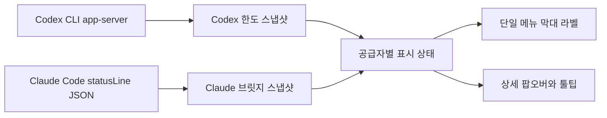

# 메뉴 막대 Codex·Claude 통합 표시 설계 제안

- 상태: 구현 및 검증 완료
- 작성일: 2026-08-20
- 대상: Token Meter macOS 메뉴 막대 앱

## 1. 배경

현재 앱은 하나의 `MenuBarExtra`에서 Codex와 Claude 값을 모두 표시할 수 있도록 구현되어 있다. 다만 메뉴 막대 라벨은 값이 존재하는 공급자만 조건부로 출력한다.

- Codex: 로컬 Codex CLI에서 현재 한도를 직접 조회하므로 대체로 즉시 표시된다.
- Claude: Claude Code 상태줄 브릿지가 캡처한 `rate_limits` 값이 있어야 표시된다.
- Claude 값이 없거나 해당 창이 리셋된 경우 `liveFiveHour`가 `nil`이 되고, 메뉴 막대의 `Cl` 구간 자체가 사라진다.

Claude Code 공식 문서에 따르면 `rate_limits`는 Claude.ai 구독자에게만 제공되며, 세션의 첫 API 응답 이후 상태줄 입력 JSON에 나타난다. 따라서 앱 시작 직후나 브릿지 설치 전에는 값이 없는 상태가 정상이다.

## 2. 목표

1. 메뉴 막대 항목은 하나만 유지한다.
2. Codex와 Claude의 상태를 항상 같은 위치에서 확인할 수 있게 한다.
3. 값이 아직 없는 상태와 실제 잔여율 0%를 명확히 구분한다.
4. 서로 다른 한도 창을 하나의 비율로 합쳐 오해를 만들지 않는다.
5. 메뉴 막대는 짧게 유지하고, 상세 정보는 팝오버와 툴팁에서 제공한다.

## 3. 권장안

메뉴 막대는 상세 수치를 나열하는 계기판이 아니라, 확인이 필요한 시점을 알려주는 **상태 아이콘**으로 사용한다. 평소에는 아이콘 하나만 표시하고 정확한 공급자·창·사용률·리셋 시간은 툴팁과 팝오버에서 제공한다.

아이콘 단계는 Codex Spark 전용 버킷을 제외한 Codex와 Claude의 유효한 한도 창 중 가장 높은 사용률로 결정한다. 사용률끼리 평균하거나 합산하지 않는다.

| 최대 사용률 | 메뉴 막대 상태 | 의미 |
|---|---|---|
| 0% 이상 30% 이하 | sun | 여유 있음 |
| 30% 초과 40% 이하 | cloud | 사용량 증가 |
| 40% 초과 50% 이하 | rain | 확인 권장 |
| 50% 초과 60% 이하 | thunder | 높은 사용량 |
| 60% 초과 80% 이하 | alert | 즉시 확인 필요 |
| 80% 초과 100% 이하 | xmark | 한도 임박 |
| 유효한 측정값 없음 | questionmark | 측정 불가 |

일부 공급자만 측정 불가이고 다른 공급자의 유효한 값이 있으면, 측정 가능한 값으로 아이콘을 결정하되 툴팁에 “일부 측정 불가”를 표시한다. questionmark는 유효한 측정값이 하나도 없을 때 사용한다.

## 4. 데이터 흐름



두 데이터 원천은 독립적으로 갱신한다. 한쪽 조회가 실패해도 다른 쪽 값은 그대로 표시한다.

## 5. 표시 상태 모델

공급자별 상태를 단순한 옵셔널 값 대신 명시적인 상태로 변환한다.

```swift
enum LimitIndicatorState: Equatable {
    case available(usedPercentage: Double, resetsAt: Date?)
    case setupRequired
    case awaitingFirstResponse
    case awaitingRefresh
    case unavailable
}
```

### Codex 상태 판정

| 조건 | 상태 |
|---|---|
| 유효한 한도 창 수신 | `available` |
| 개별 창의 리셋 시각 경과 | 해당 창을 집계 후보에서 제외 |
| CLI 미설치·미로그인·프로토콜 오류 | `unavailable` |

### Claude 상태 판정

| 조건 | 상태 |
|---|---|
| 브릿지 미설치 | `setupRequired` |
| 브릿지 설치, 스냅샷 없음 | `awaitingFirstResponse` |
| 유효한 5시간 창 존재 | `available` |
| 리셋 시각 경과 | `awaitingRefresh` |

메뉴 막대에서는 개별 상태나 숫자를 직접 표시하지 않고, 표시 대상인 `available` 값의 최대 사용률을 14절의 아이콘 단계로 변환한다. 팝오버에서는 상태에 맞춰 “상태줄 연동 필요”, “Claude Code 첫 응답 대기”, “리셋 후 새 응답 대기”처럼 원인을 구체적으로 안내한다.

## 6. Claude 연동 동작

Claude 값은 다음 순서로 채워진다.

1. 사용자가 팝오버에서 **상태줄 연동 켜기**를 선택한다.
2. 앱이 기존 Claude Code 상태줄 명령을 백업하고 브릿지를 연결한다.
3. Claude Code에서 첫 assistant 응답이 완료된다.
4. 상태줄 입력의 `rate_limits.five_hour`와 `rate_limits.seven_day`를 로컬 스냅샷에 저장한다.
5. Token Meter가 다음 새로고침에서 값을 읽고 전체 최대 사용률에 해당하는 상태 아이콘을 갱신한다.

상태줄 브릿지는 자동 설치하지 않는다. `~/.claude/settings.json`을 변경하는 작업이므로 사용자의 명시적인 버튼 동작을 유지한다.

## 7. 메뉴 및 팝오버 사양

### 메뉴 막대

- 기본 표시: 상태 아이콘 하나
- 아이콘은 Codex Spark 전용 버킷을 제외한 유효한 한도 창 중 최대 사용률로 결정
- 수치, 공급자명, 창 주기, 토큰 합계는 메뉴 막대에서 제거
- 색상에만 의존하지 않고 단계마다 아이콘 모양을 변경
- 일부 값이 측정 불가여도 유효한 값이 있으면 그 값의 상태 아이콘을 유지
- 유효한 값이 하나도 없을 때만 questionmark 표시

### 툴팁

```text
경고 원인: Claude 5시간 63% 사용
Codex 기본 7일: 11% 사용 · 4일 2시간 후 리셋
Claude 5시간: 63% 사용 · 1시간 20분 후 리셋
Claude 7일: 첫 응답 대기
오늘 사용 토큰: 128.4K
```

### 팝오버

- Codex와 Claude 카드 구조는 현재대로 분리
- Claude 카드에 브릿지 상태와 마지막 캡처 시각 표시
- 값이 없을 때 필요한 다음 행동을 한 문장으로 안내
- 새로고침 버튼은 두 공급자를 동시에 갱신

## 8. 구현 범위

### `Sources/TokenMeter/TokenMeterApp.swift`

- `UsageMonitor`에서 공급자별 `LimitIndicatorState` 계산
- `MenuBarLabel`을 단일 상태 아이콘 렌더링으로 변경
- 표시 대상인 Codex·Claude 한도 창에서 최대 사용률 계산
- 상세 수치와 토큰 합계를 툴팁으로 이동
- 상태별 툴팁 문구 추가

### `Sources/TokenMeterCore/RateLimit.swift`

- 기존 Claude 스냅샷 파싱은 유지
- 필요하면 브릿지 설치 여부와 스냅샷 존재 여부를 상태 판정 입력으로 노출

### `Sources/TokenMeterCore/CodexRateLimit.swift`

- 기존 Codex 조회·파싱 유지
- `CodexRateLimitReadResult`로 성공과 제한된 오류 유형을 반환
- Finder 환경에서도 fnm 기반 CLI가 실행되도록 선택한 `codex` 디렉터리를 자식 프로세스 `PATH`에 추가

## 9. 수용 기준

1. 메뉴 막대에 Token Meter 항목이 하나만 나타난다.
2. 메뉴 막대에는 숫자나 공급자명 대신 상태 아이콘 하나만 나타난다.
3. Codex Spark 전용 버킷을 제외한 유효한 한도 창 중 최대 사용률이 확정된 단계와 정확히 일치한다.
4. 유효한 측정값이 없으면 questionmark가 나타나고, 팝오버에 필요한 조치가 표시된다.
5. Claude 창의 리셋 시각이 지나면 이전 퍼센트를 현재 값처럼 표시하지 않는다.
6. Codex 조회 실패가 Claude 표시를 막지 않으며, 반대의 경우도 동일하다.
7. 메뉴 막대에는 상세 수치와 토큰 합계를 표시하지 않지만 팝오버와 툴팁에서는 계속 확인할 수 있다.
8. Claude 기존 상태줄 명령의 백업·복원 동작은 유지된다.
9. 앱 번들 빌드, `Info.plist` 검증, 임시 서명 검증이 통과한다.

## 10. 대안 검토

### 두 값 중 더 낮은 잔여율만 표시

예: `AI 12%`

- 장점: 가장 짧고 경고 지표로 유용
- 단점: 어느 공급자의 어떤 창인지 알 수 없고, 서로 다른 한도 주기를 하나의 값처럼 보이게 함
- 결론: 기본값으로 사용하지 않음. 추후 사용자가 선택할 수 있는 “주의 모드”로는 검토 가능

### Codex와 Claude를 번갈아 표시

- 장점: 메뉴 폭이 짧음
- 단점: 원하는 값을 보기 위해 기다려야 하고 화면이 계속 변함
- 결론: 사용하지 않음

### 현재처럼 값이 있는 공급자만 표시

- 장점: 구현이 단순함
- 단점: Claude 연동 실패와 정상적인 첫 응답 대기를 사용자가 구분할 수 없음
- 결론: 공급자별 문자열 대신 14절의 단일 상태 아이콘 방식으로 변경

## 11. 보안 및 개인정보

- 세션 로그와 한도 스냅샷은 로컬에서만 읽는다.
- API 키나 Codex·Claude 인증 파일을 직접 읽지 않는다.
- Codex 조회는 설치된 CLI의 로그인 세션에 위임한다.
- Claude 브릿지는 상태줄 입력에서 한도와 모델명만 로컬 파일로 저장한다.
- 상세 오류에 홈 디렉터리 경로나 계정 식별자를 노출하지 않는다.

## 12. 참고 자료

- [Claude Code 공식 상태줄 문서](https://code.claude.com/docs/en/statusline)
- `Sources/TokenMeter/TokenMeterApp.swift`
- `Sources/TokenMeterCore/RateLimit.swift`
- `Sources/TokenMeterCore/StatusLineBridge.swift`
- `Sources/TokenMeterCore/CodexRateLimit.swift`

## 13. 검토 의견 (Claude, 2026-08-20)

> 이 절은 수치형 이중 라벨 제안에 대한 검토 기록이다. 메뉴 막대 최종 UX는 14절의 상태 아이콘 방식으로 대체되었다.

문서의 현황 서술을 실제 코드와 대조하고, Codex CLI(`app-server` → `account/rateLimits/read`)에 직접 질의해 응답을 확인한 뒤 작성했다. 권장안의 방향(공급자별 구간 고정, `—`로 “값 없음”과 0% 구분, 서로 다른 창을 합치지 않음)에는 동의한다. 검토 당시에는 아래 13.2~13.7을 반영 전에 조정해야 한다고 판단했으며, 후속 결정이나 해결 상태는 각 항목에 별도로 기록한다.

### 13.1 사실 확인

| 문서 서술 | 확인 | 근거 |
|---|---|---|
| 메뉴 막대가 값 있는 공급자만 조건부 출력 | 일치 | `Sources/TokenMeter/TokenMeterApp.swift:169-183` |
| `liveFiveHour`가 `nil`이면 `Cl` 구간이 사라짐 | 일치 | `Sources/TokenMeter/TokenMeterApp.swift:107-110` |
| Codex는 CLI를 라이브 조회하고 `rateLimitsByLimitId.codex`를 사용 | 일치 | `Sources/TokenMeterCore/CodexRateLimit.swift:80-89` |
| `rate_limits`는 구독자 한정, 세션 첫 API 응답 이후 제공 | 일치 | Claude Code 상태줄 입력 스키마 |

### 13.2 대표 창 선택이 3절 원칙과 충돌한다 (차단)

이 계정의 실제 응답이다.

```json
"rateLimitsByLimitId": {
  "codex":           { "primary": { "usedPercent": 11, "windowDurationMins": 10080 }, "secondary": null },
  "codex_bengalfox": { "primary":   { "usedPercent": 0, "windowDurationMins": 300 },
                       "secondary": { "usedPercent": 0, "windowDurationMins": 10080 },
                       "limitName": "GPT-5.3-Codex-Spark" }
}
```

`codex.primary`의 `windowDurationMins`는 10080분, 즉 7일 창이다. 따라서 권장안의 `C 89% · Cl 94%`는 **Codex 7일 창과 Claude 5시간 창을 동일한 시각적 취급으로 병치**한다. 3절은 “서로 리셋 주기와 사용 정책이 다른 값을 하나로 합치면 병목을 숨긴다”고 밝히면서, 라벨에서는 주기 표기 없이 나란히 놓아 같은 종류처럼 보이게 한다. 합산은 아니지만 같은 오해를 만든다.

`primary`의 창 길이는 계정과 플랜에 따라 달라지므로, 같은 라벨이 계정마다 다른 주기를 뜻하게 되는 문제도 있다.

권장: 라벨에 주기를 함께 표기한다. `windowTitle()`이 이미 `10080 → "7일"` 변환을 갖고 있다(`Sources/TokenMeter/TokenMeterApp.swift:246-255`).

```text
C 7d 89% · Cl 5h 94%
```

### 13.3 `codex` 외의 limitId를 버리면 Codex 내부 병목이 숨는다 (차단)

> 후속 결정(2026-08-20): Codex Spark 사용량은 사용자 요청에 따라 표시 대상에서 제외한다. 아래 권장은 Spark 사용량도 포함하던 당시의 검토 기록이며 최종 정책에는 적용하지 않는다.

위 응답의 `codex_bengalfox`(GPT-5.3-Codex-Spark 전용, 5시간 + 7일 창)는 현재 구현이 통째로 무시한다. 해당 모델을 주로 사용하면 이 창이 먼저 소진되는데, 메뉴 막대는 `codex`의 11%만 보여준다. 3절이 공급자 사이에 적용한 논리가 Codex 내부의 여러 limitId에도 그대로 적용된다.

권장:

- 팝오버 Codex 카드는 `rateLimitsByLimitId`의 모든 항목을 `limitName`과 창 길이와 함께 나열한다.
- 메뉴 막대 대표값은 `primary` 고정이 아니라 **잔여율이 가장 낮은 창**으로 선택하고, 어떤 창인지 라벨에 표기한다.

### 13.4 `AI —` 폴백은 정보 회귀다

토큰 합계는 한도 조회 성공 여부와 무관하게 항상 로컬 로그에서 계산된다. 두 한도가 모두 없을 때 `AI —`를 표시하면 현재 동작(`AI 12.3K`)보다 정보가 줄어든다. 브릿지 미설치이면서 Codex 미로그인인 신규 사용자가 보게 되는 첫 화면이기도 하다.

권장: 폴백은 `AI {토큰 합계}`를 유지한다. 7절의 “토큰 합계를 라벨에서 제거”는 한도가 하나라도 표시될 때만 적용한다.

### 13.5 해결됨: Codex 조회 실패 원인 구분

검토 당시 `CodexRateLimitReader.read()`는 실패 원인을 구분하지 않고 `nil`만 반환해 CLI 미설치, 실행 실패, 미로그인·요청 실패, 프로토콜 오류를 같은 문구로 표시했다.

현재는 `CodexRateLimitReadResult`와 `CodexRateLimitReadFailure`로 CLI 미발견, CLI 실행 실패, App Server 초기화 실패, 한도 요청 실패, 응답 형식 오류를 구분하고 팝오버에 원인별 안내를 표시한다. fnm으로 설치된 CLI는 `/usr/bin/env node`가 Finder 환경에서도 동작하도록 선택된 `codex` 실행 파일의 디렉터리를 자식 프로세스 `PATH` 앞에 추가한다.

### 13.6 Codex의 `awaitingRefresh`는 과한 취급이다

Claude 값은 세션이 상태줄을 그려야만 갱신되지만, Codex 값은 새로고침마다 CLI에 라이브 질의한다. Codex에서 리셋 시각이 지났다는 것은 “스냅샷이 최대 1분 낡음”을 뜻할 뿐이므로, `—`를 표시하기보다 즉시 재조회하는 편이 맞다. 두 공급자를 같은 상태 이름으로 묶으면 이 차이가 가려진다.

권장: Codex는 리셋 경과를 감지하면 다음 주기를 기다리지 않고 재조회한다. `awaitingRefresh`는 재조회가 실패한 경우에만 사용한다.

### 13.7 해결됨: 갱신 경로 병렬화

검토 당시에는 세 조회가 하나의 detached task 안에서 순차 실행되어, Codex 응답이 느리면 토큰 집계와 Claude 결과 반영도 함께 지연됐다.

현재는 토큰 집계, Claude 한도 조회, Codex 한도 조회를 독립된 작업으로 병렬 실행하고 각 결과가 도착하는 즉시 반영한다(`Sources/TokenMeter/TokenMeterApp.swift:94-137`). `pendingRefreshParts`는 세 작업의 완료 여부만 추적하며, 모두 끝났을 때 `isRefreshing`을 해제한다. 따라서 느린 작업이 다른 결과의 반영을 막지는 않지만, 중복 새로고침 방지를 위해 새로고침 버튼은 세 작업이 모두 끝날 때까지 비활성으로 유지된다. 수용 기준 6도 지연 측면에서 충족한다.

### 13.8 이미 충족된 수용 기준

| 기준 | 상태 |
|---|---|
| 1. 메뉴 막대 항목이 하나만 나타난다 | `MenuBarExtra`가 하나뿐이고 실행 중 프로세스도 하나. 코드 변경 대상이 아니다. |
| 9. 임시 서명 검증 | `scripts/build-app.sh`에 `codesign --force --sign -`가 이미 있다. |

### 13.9 반영 시 권장 라벨 사양

| 상태 | 메뉴 막대 |
|---|---|
| 모두 정상 | `C 7d 89% · Cl 5h 94%` |
| Claude 값 없음 | `C 7d 89% · Cl —` |
| Codex 값 없음 | `C — · Cl 5h 94%` |
| 모두 값 없음 | `AI 128.4K` |

창 표기는 대표 창의 `windowDurationMins`에서 파생하며, 공급자마다 다른 값이 나올 수 있음을 전제한다.

## 14. 최종 UX 결정: 상태 아이콘

메뉴 막대는 상세 사용률을 직접 표시하지 않고, 가장 사용률이 높은 유효한 한도 창의 심각도를 아이콘 하나로 표현한다.

| 원시 최대 사용률 | 상태 이름 | 아이콘 후보 |
|---|---|---|
| `0...30` | sun | `sun.max.fill` |
| `30 초과...40` | cloud | `cloud.fill` |
| `40 초과...50` | rain | `cloud.rain.fill` |
| `50 초과...60` | thunder | `cloud.bolt.rain.fill` |
| `60 초과...80` | alert | `exclamationmark.triangle.fill` |
| `80 초과...100` | xmark | `xmark.octagon.fill` |
| 측정값 없음 | unavailable | `questionmark.circle.fill` |

경계값은 반올림된 표시값이 아니라 원시 `usedPercentage`로 판정한다. 입력이 범위를 벗어날 경우 `0...100`으로 제한한 뒤 판정한다.

### 집계 규칙

1. Codex의 `rateLimitsByLimitId` 중 Spark 전용 버킷을 제외한 primary·secondary 창과 Claude의 5시간·7일 창을 후보로 수집한다.
2. 리셋 시각이 지난 값은 후보에서 제외한다.
3. 후보 중 사용률이 가장 높은 값을 선택한다.
4. 선택한 값의 구간에 해당하는 아이콘을 메뉴 막대에 표시한다.
5. 후보가 없으면 `questionmark.circle.fill`을 표시한다.
6. 일부 공급자가 측정 불가여도 유효한 후보가 있으면 아이콘을 계산하고, 측정 불가 사실은 툴팁과 팝오버에 표시한다.

Codex Spark 판정은 현재 응답의 `limitId == "codex_bengalfox"` 또는 `limitName`에 `Codex-Spark`가 포함된 경우로 한다. 이 버킷은 응답 호환성을 위해 파싱에는 유지하지만 아이콘 후보와 팝오버 행에서는 제거한다.

### 상호작용

- 아이콘에 마우스를 올리면 가장 높은 사용률의 공급자, 모델·버킷, 창 주기, 사용률, 리셋 시간을 표시한다.
- 팝오버에서는 Codex Spark를 제외한 Codex·Claude 창을 사용률 내림차순으로 확인할 수 있다.
- 단계가 변경되어도 기본적으로 macOS 알림을 보내지 않는다.
- 후속 옵션으로 `xmark` 단계에 처음 진입할 때 한 번만 알림을 보내는 기능을 검토한다.
